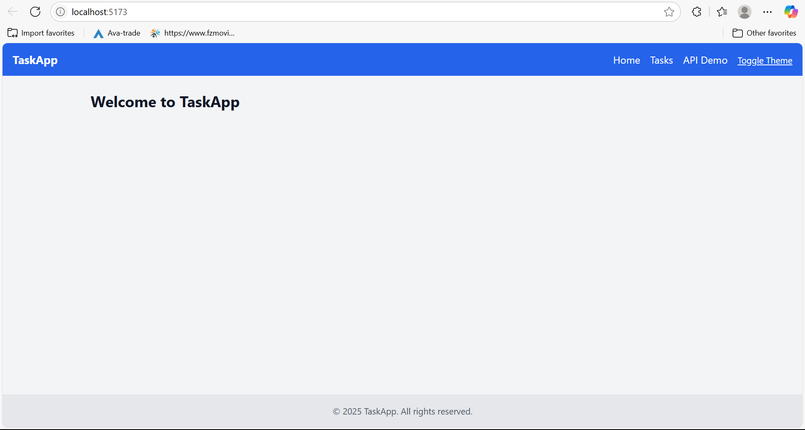
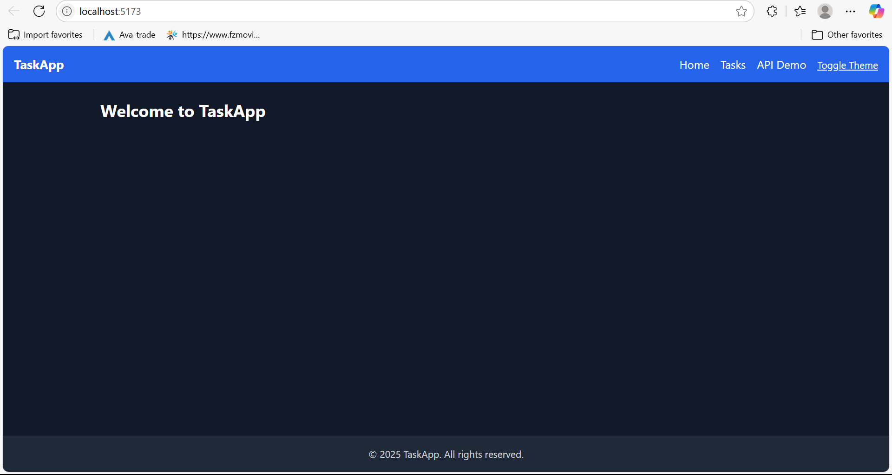

# 🌟 Task Manager App (React + Tailwind CSS)

This project is a feature-rich task management application built using React, Tailwind CSS, and Vite. It includes component architecture, state management with hooks, API integration, theme switching, and responsive design.

## 🔧 Features

- 🧱 Reusable UI components: Button, Card, Navbar, Footer
- ✅ Task management: add, complete, delete, filter
- 🌗 Theme switcher: light/dark mode
- 📱 API Integration: fetch and search posts from JSONPlaceholder
- 🎨 Responsive design with Tailwind CSS
- 📀 LocalStorage persistence
- 💥 Custom animation (fade-in)

## 🚀 Live Demo

👉 [View Deployed App](https://your-vercel-link-here)

## 📷 Screenshots

| Light Mode                        | Dark Mode                       |
| --------------------------------- | ------------------------------- |
|  |  |

## 🛠️ Getting Started

```bash
git clone https://github.com/PLP-MERN-Stack-Development/week-3-react-js-assignment-Sihlesnimba.git
cd week-3-react-js-assignment-Sihlesnimba
npm install
npm run dev
```

## 🧪 Tech Stack

- React (Vite)
- Tailwind CSS
- React Router
- JSONPlaceholder API

## 👤 Author

Sihle — [GitHub](https://github.com/Sihlesnimba)
